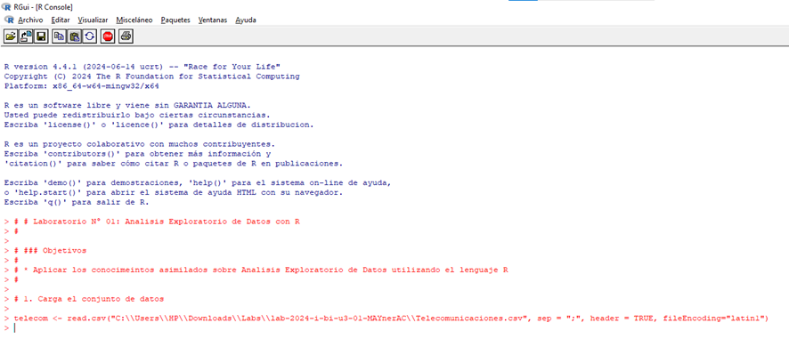
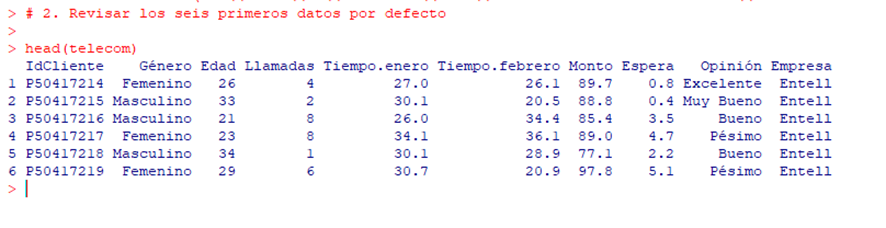
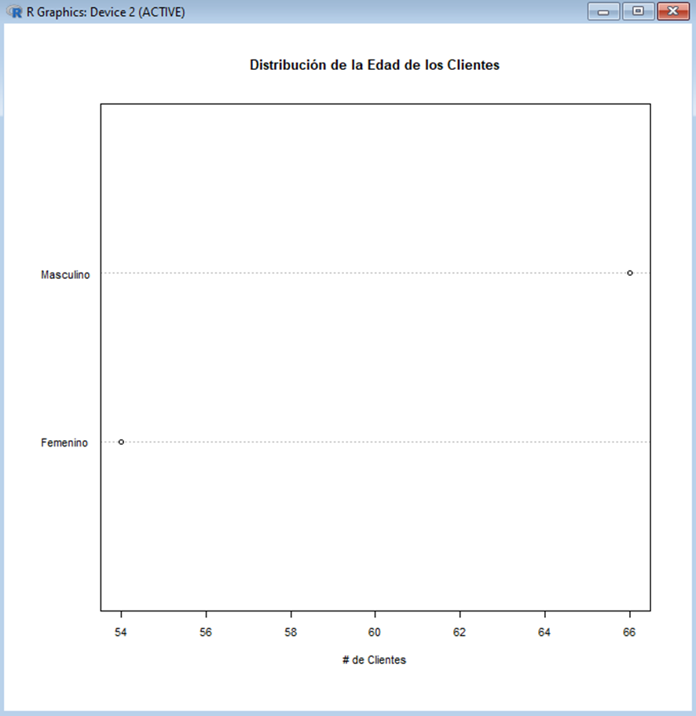
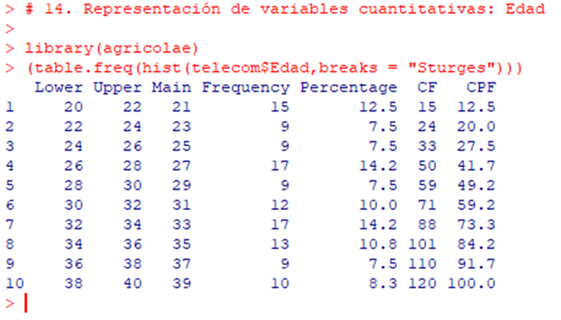

[](https://classroom.github.com/a/bmWTRqek)
[](https://classroom.github.com/open-in-codespaces?assignment_repo_id=15369182)
# SESION DE LABORATORIO N° 01: Análisis Exploratorio de Datos

### Nombre: Mayner Gonzalo Anahua Coaquira

## OBJETIVOS
  * Desarrolla el analisis exploratorio de un conjunto de datos utilizando R.

## REQUERIMIENTOS
  * Conocimientos: 
    - R Notebools.
  * Hardware:
    - Virtualization activada en el BIOS.
    - CPU SLAT-capable feature.
    - Al menos 4GB de RAM.
  * Software:
    - Docker Desktop 
    - R Server 20 o superior
## CONSIDERACIONES INICIALES
  * Clonar el repositorio mediante git para tener los recursos necesarios.
  * Colocar su nombre en el archivo
    
## DESARROLLO

#### Instalar y cargar los paquetes
```R
# Seleccionar el espejo de CRAN
options(repos = c(CRAN = "http://cran.us.r-project.org"))

# Instalar paquetes si no están ya instalados
if(!require(mlr)) install.packages('mlr', dependencies=TRUE)
if(!require(VIM)) install.packages('VIM', dependencies=TRUE)
if(!require(gmodels)) install.packages('gmodels', dependencies=TRUE)
if(!require(gdata)) install.packages('gdata', dependencies=TRUE)
if(!require(plotrix)) install.packages('plotrix', dependencies=TRUE)
if(!require(agricolae)) install.packages('agricolae', dependencies=TRUE)

# Cargar los paquetes
library(mlr)
library(VIM)
library(gmodels)
library(gdata)
library(plotrix)
library(agricolae)
```

#### 1. Carga el conjunto de datos
```R
#telecom <- read.csv("Telecomunicaciones.csv", sep = ";", header = TRUE, fileEncoding="latin1")
telecom <- read.csv("C:\\Users\\HP\\Downloads\\Labs\\lab-2024-i-bi-u3-01-MAYnerAC\\Telecomunicaciones.csv", sep = ";", header = TRUE, fileEncoding="latin1")
```



#### 2. Revisar los seis primeros datos por defecto 
```R
head(telecom)
```



#### 3. Verificar la estructura de los datos
```R
str(telecom)
```


#### 4. Revisar un resumen de los datos
```R
summary(telecom)
```


#### 5. Revisar un resumen de los datos en columnas
```R
library(mlr)
summarizeColumns(telecom)
```


#### 6. Revisar graficamente el porcentaje de nulos
```R
library(VIM)
aggr(telecom,numbers=TRUE, plot = T)
```


#### 7. Visualizar la tabla y frecuencia con formato SAS
```R
library(gmodels)
library(gdata)
CrossTable(telecom$Género, format="SAS")
```


#### 8. Visualizar la tabla y frecuencia con formato SPSS
```R
CrossTable(telecom$Género, format="SPSS")
```


#### 9. Visualizar gráficos de resumen de las variables: gráfico de barras
```R
frec <- table(telecom$Género)
barplot(frec, main="Distribución del género de los clientes", xlab="Género", ylab="Cantidad de Clientes")
```


#### 10. Visualizar gráficos de resumen de las variables: pie
```R
pie(frec, main="Distribución del género de los clientes", xlab="Género")
```


#### 11. Visualizar gráficos de resumen de las variables: pie 3D
```R
library(plotrix)
lbls1 <- paste(names(table(telecom$Género)), "\n", prop.table(table(telecom$Género))*100,"%", sep="")
pie3D(table(telecom$Género), labels = lbls1,explode=0.15, main="Distribución de la Edad de los Clientes")
```


#### 12. Visualizar gráficos de resumen de las variables: grafico de puntos
```R
dotchart(table(telecom$Género), cex=.7, main="Distribución de la Edad de los Clientes", xlab="# de Clientes")
```




#### 13. Generar tablas dinamicas o de contingencia
```R
tablacruzada<-table(telecom$Opinión, telecom$Género)
tablacruzada

CrossTable(telecom$Opinión, telecom$Género, format="SPSS")
```


#### 14. Representación de variables cuantitativas: Edad
```R
library(agricolae)
(table.freq(hist(telecom$Edad,breaks = "Sturges")))
```




#### 15. Representación de variables cuantitativas: Tiempo de llamadas en Enero
```R
(table.freq(hist(telecom$Tiempo.enero,breaks = "Scott")))
```


#### 16. Representación de variables cuantitativas: Monto
```R
(table.freq(graph.freq(telecom$Monto,plot=FALSE)))
```


#### 17. Representación de variables cuantitativas: Tiempo de llamadas en febrero
```R
(table.freq(hist(telecom$Tiempo.febrero,breaks = "FD")))
```


#### 18. Representación de variables cuantitativas de forma gráfica: Histograma
```R
hist(telecom$Tiempo.enero, col = 2)
```


#### 19. Representación de variables cuantitativas de forma gráfica: Histograma y linea de distribución
```R
histograma<-hist(telecom$Tiempo.enero,breaks = "Sturges", xlab="Edad", ylab="Número de clientes",)
polygon.freq(histograma,frequency=1,col="red")
```


#### 20. Representación de variables cuantitativas de forma gráfica: linea de distribución
```R
histograma1<-hist(telecom$Tiempo.enero,border=FALSE)
polygon.freq(histograma,frequency=1,col="red")
```


#### 21. Representación de variables cuantitativas de forma gráfica: Comparativa de Histogramas
```R
par(mfrow=c(1,2))
hist(telecom$Tiempo.enero[telecom$Género=="Masculino"],ylim=c(0,20))
hist(telecom$Tiempo.enero[telecom$Género=="Femenino"],ylim=c(0,20))
```


#### 22. Representación de variables cuantitativas de forma gráfica: Gráfico de Caja
```R
boxplot(telecom$Tiempo.enero, col = 3)
```


